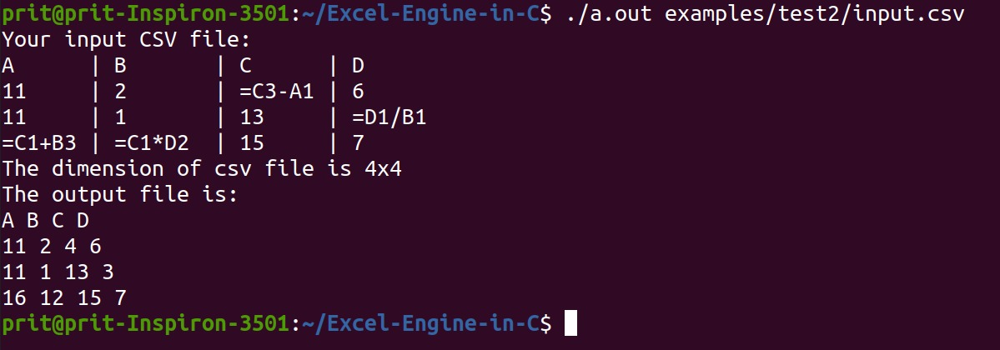

# Excel-Engine-in-C


## Table of Contents

- [Project](#Excel-Engine-in-C)
  - [Table of Contents](#table-of-contents)
  - [About The Project](#about-the-project)
  - [Results](#results)
  - [File Structure](#file-structure)
  - [Getting started](#Getting-Started)
  - [Features](#features)
  - [Contributors](#contributors)
  - [Acknowledgements and Resources](#acknowledgements-and-references)
  - [License](#license)
  
## About

Naive implementation of an excel engine in C.

## Results

### Input

```
A      | B       | C      | D 
11     | 2       | =C3-A1 | 6
11     | 1       | 13     | =D1/B1
=C1+B3 | =C1*D2  | 15     | 7
```

### Output



For more results, refer ```examples```.

## File Structure
```
👨‍💻Excel-Engine-in-C
 ┣ 📂assets                            // Contains all the reference gifs, images
 ┣ 📄main.c                            // Driver Code
 ┣ 📂examples                          // Contains all examples
   ┣ 📂test1                            
   ┃ ┣ 📄input.csv                     // Input CSV file  
   ┃ ┣ 📄README.md                     // Results and Conclusions
 ┣ 📄README.md                          
   

     
``` 
## Getting Started

### Prerequisites
To download and use this code, the minimum requirements are:

* Ubuntu 20.04 or later
* gcc or any other compiler

### Installation

Clone the project by typing the following command in your Terminal/CommandPrompt

```
git clone https://github.com/PritK99/Excel-Engine-in-C.git
```
Navigate to the Excel-Engine-in-C folder

```
cd Excel-Engine-in-C
```

### Usage

Once the requirements are satisfied, you can easily use the project on yout machine
After following the above steps , use the following commands to:

To build the code
```
gcc main.c
```

To run the code
Usage: ```./a.out <path to input csv file```
```
./a.out examples/test1/input.csv
```
## Features

* To evaluate expressions (refer ```examples/test1```)
* Works with Addition, Subtraction, Multiplication and Division Operators (refer ```examples/test2```)
* Able to solve nested expressions and dependencies (refer ```examples/test2```)
* Able to detect and report circular dependencies in expressions (refer ```examples/test3```)

## Contributors
* [Prit Kanadiya](https://github.com/PritK99)

## Acknowledgements and References
* https://github.com/tsoding/minicel
 
## License
[MIT License](https://opensource.org/licenses/MIT)


